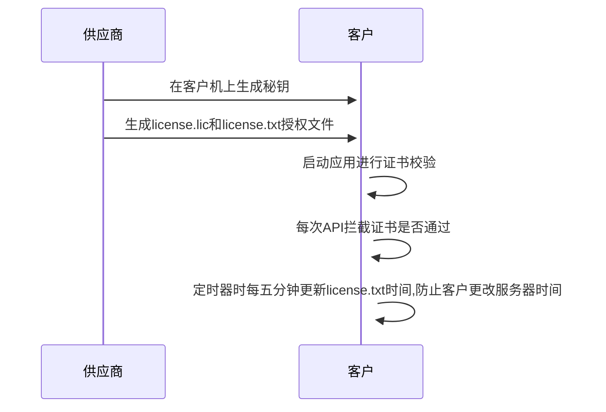

# jar授权管理


## 一、背景

在项目交付后，为了避免客户随意地使用项目，可以考虑添加License（软件许可），对项目的使用时间、硬件信息等参数进行验证。如果用户需要修改时间和项目部署位置，只需要重新生成一个新License文件替换即可，这样可以避免修改源码、改动部署等繁琐操作。


## **二、TrueLicense**

由于 btbox-common-license 模块是使用了 TrueLicense 在这里也说明一下 TrueLicense 的用处

TrueLicense（打开新窗口）是JVM上用于许可证管理的开源引擎。由于其功能性和模块化设计，它可以从简单的许可模式扩展到复杂的许可模式。

官网地址：[https://truelicense.namespace.global/](https://link.zhihu.com/?target=https%3A//truelicense.namespace.global/)

原理如下：

1. 使用KeyTool生成生成密钥对，包含私钥和公钥；
2. 获取服务器硬件信息，填写日期范围，生成 license证书文件；
3. 将公钥放在代码中使用，用于验证 license 签名证书是否符合使用条件


## 三、添加秘钥

```shell
# 生成证书,只能用jdk8，openJdk的算法貌似有问题
keytool -genkeypair -keysize 1024 -validity 3650 -alias "privateKey" -keystore "privateKeys.keystore" -storepass "public_password1234" -keypass "private_password1234" -dname "CN=localhost, OU=localhost, O=localhost, L=SH, ST=SH, C=CN"
```
```shell
# 导出命令
keytool -exportcert -alias "privateKey" -keystore "privateKeys.keystore" -storepass "public_password1234" -file "certfile.cer"

```
```shell
#导入命令
keytool -import -alias "publicCert" -file "certfile.cer" -keystore "publicCerts.keystore" -storepass "public_password1234"

```

## 四、如何使用

### 1. 添加依赖

- 首先确保已经添加了依赖模块 btbox-common-license ，例如在btbox-admin模块下添加依赖

```xml
<dependency>
    <groupId>org.btbox</groupId>
    <artifactId>btbox-common-license</artifactId>
</dependency>
```

### 2. 在配置文件中添加如下配置

```yml
   # 证书校验
   license:
     # 是否启用
     enable: true
     # 项目的名称
     subject: ${spring.application.name}
     # 公钥别名
     public-alias: publicCert
     # 密码
     store-pass: public_password1234
     # 要校验的license.lic文件路径
     license-path: D:/license/license.lic
     # 公钥文件地址
     public-keys-store-path: D:/license/publicCerts.keystore
     # 加密密码
     license-txt-pwd: jkadsivvBqkwwpx&
     # 加密偏移量
     license-txt-lv: $qcagkspqNatupyf
```

   

### 3. 生成证书 license.lic

- 接口地址: /license/generate-license

- 请求参数: 

  ```json
  {
      "subject": "license_demo",
      "privateAlias": "privateKey",
      "keyPass": "private_password1234",
      "storePass": "public_password1234",
      "licensePath": "D:/license/license.lic",
      "privateKeysStorePath": "D:/license/privateKeys.keystore",
      "issuedTime": "2022-04-10 00:00:01",
      "expiryTime": "2022-05-31 23:59:59",
      "consumerType": "User",
      "consumerAmount": 1,
      "description": "这是证书描述信息",
      "licenseCheckModel": {
          "ipAddress": [],
          "macAddress": [],
          "cpuSerial": "",
          "mainBoardSerial": ""
      }
  }
  ```

- 参数说明请看 `LicenseCreatorParam` 和` LicenseCheckModel` 这两个类

- 发送请求后会生成 license.lic  授权文件在 D:/license 目录下

- 同时也会生成 license.txt 加密文件在 D:/license 目录下，主要用于离线部署的时候定时校验应用使用的时间正确性，避免用户修改电脑的时间后无法准确定位时间


## 五、大致流程图



